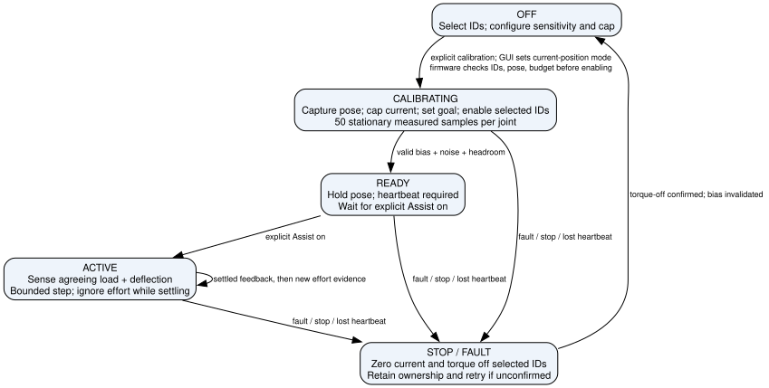

# Measured-effort Assist (v0.9.1)

The **Assist** GUI tab implements a conservative, stepwise assistance controller.
It runs on the board; Python configures it, displays diagnostics, and renews a
one-second lease. It is separate from the telemetry predictor and Auto-ROM.
No LQR is implemented. No external helper/EMG input is connected to this mode yet.

## Operator workflow

1. Reflash the updated v0.9.1 firmware and restart the Python GUI. `info` must
   contain `Assist Protocol: assist-v1`; the firmware version alone is insufficient.
   The existing Protobuf build flag still applies.
2. Apply the correct side-specific home, direction and joint limits. The GUI
   selects **current-position** mode automatically when calibration is requested;
   that transition disables all motors. Only the assist selection is then enabled.
   The sum of selected
   assist current caps must fit the configured total current budget.
3. In **Assist**, select those joints. Defaults are a 10-mA trigger threshold,
   0.01 encoder degree/mA assistance gain, and a 40-mA current cap. Lowering
   threshold increases sensitivity. Gain controls the size of each assist step.
4. Relax at the intended pose and click **Calibrate relaxed bias**. This captures
   the current position as the hold goal, applies the current cap and a slow
   position profile, waits 500 ms, then collects 50 stationary measurements per
   joint. Firmware installs the selected current cap and a fresh in-range goal
   before enabling each selected motor. Keep the GUI connected throughout.
5. Once the display says **Bias ready**, toggle **Assist on**. The table shows
   bias, effective deadzone, signed residual effort, and sensing/settling state.
6. **Assist off**, **Stop / torque off**, and global **STOP ALL MOTION** disarm
   the session. Bias is invalidated; recalibrate to
   restart. Assist does not return home or restore an earlier current/profile.

The controls are intentionally bounded for initial testing. If calibration
reports insufficient current headroom, that pose cannot be supported with the
chosen cap and trigger threshold. Raising the assist ceiling automatically is
not part of this controller. Reposition or use a mechanically supported pose.

## Calibration rejection diagnostics

The SDK reads `assist_status` after a rejected `assist_calibrate` command on
either transport. It reports the failed condition and, when available, the
motor ID, measured angle and velocity. It does not retry or enable motors.
The GUI retains the error after stop cleanup. Examples include
`requires_current_position`, `motor_disabled`, `unselected_motor_enabled`,
`not_settled`, `stored_limit`, `motor_current_limit` and `current_budget`.
Firmware adds optional `reject_id`, `reject_angle_deg` and
`reject_velocity_deg_s` fields to the status header; Protobuf framing is unchanged.
Older firmware still exposes its less-specific reason through this SDK path.

After Auto-ROM, the GUI re-establishes current-position mode automatically.
A Home sequence completing its command queue does not establish that every
joint has physically settled. Assist preflight still requires speed at most
1 deg/s and a pose at least 2 motor degrees inside both stored limits.

## What is measured

Every control observation reads **PRESENT_POSITION, PRESENT_VELOCITY and
PRESENT_CURRENT**, plus torque-enabled status, directly from the selected motor. Estimated GUI telemetry is
never used to trigger assistance. Up to one joint is sampled per service pass;
service is paced at 5 ms and a given joint no faster than 20 ms. Fleet size and
bus latency determine the actual rate. An observation gap above 500 ms faults.
During assist ownership, NX/Protobuf telemetry reuses these measured samples
(method 5, control cache), preserving their original sample uptime/UTC stamps.
Polling faster does not fabricate newer samples or issue competing motor reads.
Unselected, missing or stale control samples are unavailable, never reported as
measured zeros or estimated user effort.

In current-based position mode, the motor's position controller requests current
to oppose a displacement. Goal Current limits this request. In pure current
mode, current follows the supplied command; it cannot independently indicate
user effort. Motor current is not a direct external joint-force measurement.
The electrical control modes are described in the
[ROBOTIS XC330-T288 manual](https://emanual.robotis.com/docs/en/dxl/x/xc330-t288/).

This implementation treats holding-current residual as a **load proxy** and
requires agreeing measured deflection before moving. It assumes positive raw
motor current opposes a negative external deflection; both are in the motor's
encoder coordinates, before application-level flip/home transforms. Verify
that sign relationship on each actual motor/linkage; inverse or ambiguous
behavior must not be compensated by guessing a software direction.

## Control law and calibration

For relaxed samples, Welford's algorithm estimates mean current `b` and standard
deviation `sigma`. Mean encoder tracking error `e0` is recorded too. The
effective trigger deadzone in mA is:

```
D = max(configured_threshold, 5, 3*sigma)
effort = -(measured_current - b)
deflection = measured_position - hold_goal - e0
```

At least 150 ms of successive observations must show `abs(effort) > D` and
`sign(effort)*deflection >= 0.15 degree`, with measured speed at most 1 deg/s.
Then the next goal is calculated from the **measured current position**:

```
step = min(0.5 degree, gain * (abs(effort) - D))
next_goal = measured_position + sign(effort)*step
```

Sub-0.1-degree steps are not sent. While moving, readings cannot trigger a new
step. The joint must settle for at least 400 ms, with speed at most 1 deg/s and
tracking error (relative to calibrated `e0`) at most 0.3 degree; failure to
settle within 2 seconds stops the session. Effort must qualify afresh afterwards.
This is a bounded admittance-style position step, not proportional open-loop
current feedback and not an identified physical impedance controller.

Preflight also checks actual operating mode and rejects Drive Mode's reverse,
time-based profile, and torque-on-by-goal bits (`unsupported_drive_mode`). It
does not silently alter EEPROM settings.

The motion profile uses `PROFILE_VELOCITY=4` (0.916 rpm, about 5.5 deg/s) and
`PROFILE_ACCELERATION=1`. Firmware retains those settings after stopping;
ordinary mode/profile configuration can change them again. The controller does
not modify the stored ROM limits, telemetry gain, stiffness or gravity moment.

Bias calibration is local: motion or a new goal more than **5 encoder degrees**
from the calibration pose stops with `bias_pose_changed`. Recalibration is
required. A single relaxed baseline cannot remove gravity over an entire ROM
or after changing arm orientation. Friction, strap loading, current-to-torque
nonlinearity and user co-contraction remain unmodeled.

## Ownership and stops

Calibration, READY and ACTIVE all reserve motor control. Other GUI motion pages
are disabled, incoming UDP motion is ignored, and firmware rejects competing
ASCII and Protobuf motion/configuration commands. Normal gesture updates and
the current-position allocator pause. The selected caps individually respect
configured current limits, and their sum must not exceed the total budget.
No enabled unselected motor is permitted at calibration start.

The firmware stops for missing/invalid/stale feedback, lost heartbeat, excessive
speed (10 deg/s), tracking error (2 degrees), measured current above cap + 5 mA,
step excursion (2 degrees), pose-window exit, or the stored-limit margin
(2 degrees). Proposed goals must also stay inside that margin. Measured velocity
is quantized by the motor; the 1-deg/s settling test generally requires a zero
velocity-register sample.

Stop attempts zero current and torque-off independently on each selected ID.
If torque-off is not acknowledged, the state remains **4 / torque-off
unconfirmed** and firmware retries; ownership is retained rather than allowing
other movement. A late heartbeat cannot rearm an expired session. The GUI sends
heartbeats every 250 ms, with at most one pending assist operation. Unsent starts
and heartbeats are canceled by Stop. Disconnect stops heartbeats; the firmware
lease is the fallback if a stop request cannot reach the board.

These are cooperative firmware deadlines and sampled checks. A blocked bus or
loop can delay a stop, and torque-off does not brake a falling load. Software
checks do not establish a physical guarantee against passing a limit.

## SDK and wire contract

Use explicit integer DXL IDs:

```python
exo.configure_assist(16, threshold_mA=10, gain_deg_per_mA=0.01, current_cap_mA=40)
exo.set_control_mode("current_position")  # all torque off
exo.calibrate_assist([16])     # capture capped hold, then enable only ID 16
# During calibration, READY, and ACTIVE: renew at ~250 ms and inspect status.
exo.heartbeat_assist()
status = exo.get_assist_status()
# Only once status['state'] == 2, and on an explicit operator action:
exo.start_assist()
# Continue heartbeats; on exit:
exo.stop_assist()
```

The GUI owns the heartbeat scheduling; this snippet is not a standalone loop.

| API operation | ASCII | Protobuf opcode |
|---|---|---|
| Configure one joint | `assist_config:<id>:<threshold>:<gain>:<cap>` | 14; one ID, three `values` |
| Calibrate selected joints | `assist_calibrate:<id>[:<id>...]` | 15; explicit IDs |
| Start | `assist_start` | 16; no fields |
| Heartbeat | `assist_heartbeat` | 17; no fields |
| Stop | `assist_stop` | 18; no fields |
| Status | `assist_status` | Slow text endpoint in both builds |

Status starts `ASSIST: state=<0..4> reason=<reason>` and contains one
`ASSIST_JOINT:` line per selected ID: samples, bias/noise/deadzone, effort,
deflection, angle/goal, moving, steps, and sample age. States are OFF,
CALIBRATING, READY, ACTIVE and STOP_UNCONFIRMED. Protobuf builds advertise
`assist_v1` in `USB Features` as well as the shared `Assist Protocol` metadata.

## Minimum remaining checks before wearing

The implementation and simulated tests are not a wearer validation. First run
these checks with the mechanism supported on the bench:

- Verify calibrated limits, encoder direction and agreeing current/deflection
  signs for each selected joint under a gentle applied load in both directions.
- Confirm no assist steps at rest, including at the edge of the 5-degree bias
  window; measure noise and available current headroom in representative poses.
- Confirm the actual 40-ms current waveform, achieved feedback rate and limited
  position-step response under the intended telemetry load.
- Verify Stop and host disconnect physically remove effort. Ensure the mechanism
  is supported when torque is removed.

For wider continuous assistance, the next requirement is a pose-dependent load
bias model or independent effort sensing validated across that ROM. A future EMG
helper should modulate a bounded assist step only after the same measured-effort
gate, with its own freshness check; it must not bypass limits or rearm a session.

## Verification

Native tests execute the actual assist firmware methods against a fake bus,
covering relaxed bias, positive/negative assistance, rejection of current alone,
no triggering during commanded movement, limits, stale feedback, mode/ROM/budget
preconditions, expired leases and failed torque-off retries. Python tests cover
typed SDK transport selection, Protobuf decoding, cancellation of unsent starts,
and the GUI's calibration/enable/stop states. Hardware validation remains open.

<!-- graphviz:docs/figures/assist_mode.dot -->

<!-- /graphviz:docs/figures/assist_mode.dot -->
