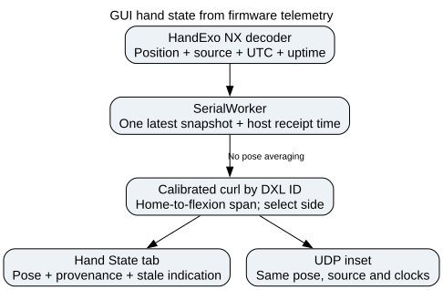

# GUI Workflow Reference

> `[VERIFIED]` = confirmed from source. `[INFERRED]` = reasonable but unverified.

File: `src/nml_hand_exo/applications/hand_exo_gui.py`

```bash
python src/nml_hand_exo/applications/hand_exo_gui.py
```

---

## Architecture

The GUI is a single-file PyQt5 application. It owns the `HandExo` connection and passes it
into modal `QDialog` subclasses for calibration and ROM assessment. It does **not** call
or subprocess `calibrate_exo.py` — calibration logic is implemented inline. `[VERIFIED]`

Key classes in `hand_exo_gui.py`:

| Class | Purpose |
|-------|---------|
| Main window (unnamed at top level) | Connection panel, motor control, gesture control |
| `CalibrationDialog` | Interactive calibration — open/close recording |
| `ROMDialog` | ROM assessment — 4-phase recording with QTimer polling |

---

## Connection modes `[VERIFIED]`

Connect runs the handshake off the Qt thread and logs each phase. Connect,
Refresh, Probe and port/mode controls remain disabled while it runs. Failed opens
release the CDC handles. Firmware v0.9+ completes UTC synchronization before the
handshake returns and before polling starts. Missing UTC never blocks `info` or
`help` in firmware; unsynchronized telemetry reports UTC zero. See
[connection troubleshooting](gotchas.md#connect-stalls-then-a-retry-cannot-open-the-cdc-port).

The mode combo (Right Only / Left Only / Dual) is selected before connecting and locked
while connected. All modes use one `HandExo` connection. `AutoSerialComm` reads `info` before choosing `SerialComm`, `DualSerialComm`, or
`ProtobufSerialComm`. The GUI no longer has a Dual USB CDC checkbox. Protobuf
builds advertise the text and binary port roles; unsupported layouts fail with
a connection error. The ASCII shadow-stream option is disabled on Protobuf
builds; ordinary telemetry uses the binary RPC. See [USB discovery and diagnostics](usb_protocol_and_io_diagnostics.md).

At connect time, `_connect()` builds:

| Variable | Content |
|---|---|
| `_motor_dxl_id` | DXL hardware IDs for active-side motors, in widget order |
| `_left_motor_names` | bare motor names for left motors detected |
| `_right_motor_names` | bare motor names for right motors detected |
| `motor_names` | display names (bare in single-side, `L:/R:` prefixed in Dual) |
| `motor_widgets` | one dict per active motor for GUI state tracking |

After building `_motor_dxl_id`, any motor detected on the bus but NOT in that list is
immediately disabled (`disable:<id>`) to prevent firmware broadcast commands from
moving the inactive side. In Dual mode, `_motor_dxl_id` includes all detected IDs, so
nothing is disabled.

---

## Setup motor limits `[VERIFIED]`

Each motor row exposes an explicit-ID current limit in mA and velocity limit in
rpm. **Apply** writes the current limit only to that row's Dynamixel ID; it
retains the velocity value as that motor's host-side ceiling for GUI direct and
EMG teleoperation commands. The current limit remains subject to the shared
combined-current budget. The GUI deliberately does not derive this ceiling from
`PROFILE_VELOCITY`: raw zero means an unlimited position profile and that
register is not used in Velocity Control Mode. Firmware independently clamps
direct commands to 50 rpm and verifies each motor's hardware `VELOCITY_LIMIT`
register before entering Velocity mode.

For EMG teleoperation, **Current / Torque** can also drive an explicit motor or
custom finger group. The signed decoder effort scales the configured maximum
current for every target. Per-row current limits are applied first; if the sum
of absolute target currents exceeds the combined-current budget, every target
is reduced by the same proportion so the grasp pattern is preserved. An active
auxiliary hold is reserved from that budget. This is continuous current control:
zero or stale intent releases commanded current rather than holding position.
The read-only Phase-1 shadow recorder is intentionally Velocity-only.

---

## CalibrationDialog `[VERIFIED]`

### Initialization
- Receives `HandExo`, `motor_names` (target-side only), `profile_name`, `side`, and `dxl_ids`
- Builds `_motor_idx = {name: dxl_id}` from the provided `dxl_ids` list
- Disables only the target-side motors by DXL ID (not `disable:all`)
- Two streaming phases: extension (open), then flexion (close)

### Recording flow (streaming, 100 ms timer)
```
Phase 0 — Extension:
  QTimer → _poll_angles() every 100 ms
    → exo.get_absolute_motor_angle('all')  returns {dxl_id: value}
    → for each motor, angles.get(_motor_idx[name]) → append to _samples_buf[name]
  Stop → commit to _open_samples if ≥ 3 samples per motor

Phase 1 — Flexion:
  same mechanism → commit to _close_samples
  → _save_profile()
```

### `_save_profile()` — what it computes
```python
for name in motor_names:
    o_med = median(_open_samples[name])
    c_med = median(_close_samples[name])
    all_vals = _open_samples[name] + _close_samples[name]
    data["motors"][name] = {
        "home":      round(o_med, 2),
        "flip":      c_med < o_med,
        "limit_min": round(min(all_vals), 2),
        "limit_max": round(max(all_vals), 2),
    }
save_profile(profile_name, data, side=self._side)   # writes profiles/<name>.json
set_default_profile(profile_name, side=self._side)  # always updates default
```

### What `_save_profile()` does NOT do `[VERIFIED]`
It does **not** call `update_config_h()`. After a GUI calibration, `config.h` firmware
defaults (`HOME_STATES[]`, `jointLimits[][]`, `DEFAULT_FLIPS[]`) are **not updated**.
The device receives new values over serial for the current session, but the firmware
defaults persist until the CLI is used or `config.h` is edited manually.

To update `config.h` after GUI calibration: run
```bash
python examples/calibration/calibrate_exo.py --port COM<N> --apply <profile>
```

---

## ROMDialog `[VERIFIED]`

### State machine
Four phases driven by `self._phase` (0–3):
```
0: Phase 1 – Unassisted ROM: OPEN hand
1: Phase 1 – Unassisted ROM: CLOSED hand
2: Phase 2 – Assisted ROM:   OPEN hand
3: Phase 2 – Assisted ROM:   CLOSED hand
```

### Recording mechanism
- Uses a `QTimer` (`self._timer`) polling `_poll_angles()` on each tick
- Accumulates angle samples in `self._phase_data[phase]` as lists per motor
- User clicks "Start Recording" / "Stop Recording" to control the timer
- Motor orientation (home, flip) is auto-detected from the loaded calibration profile

### Output
Saves to `output_data/<participant>_rom_<date>_<run>.csv` with columns:
`participant, date, run, motor, flip, phase,`
`open_abs_max, open_abs_min, closed_abs_max, closed_abs_min,`
`open_norm_max, open_norm_min, closed_norm_max, closed_norm_min, rom_deg`

Normalized angles: `0 = home/open`, positive = closing direction.
`rom_deg = closed_norm_max − open_norm_min`

---

## Shared utility modules `[VERIFIED]`

The GUI imports reusable non-Qt logic instead of defining it in `hand_exo_gui.py`:

- Calibration profile persistence: `nml_hand_exo.calibration.profiles`
- ROM calculations and run numbering: `nml_hand_exo.calibration.rom`
- Repository data paths: `nml_hand_exo._paths`
- Serial-port label formatting: `nml_hand_exo.interface._serial_ports`

The GUI and CLI use the same profile directory and profile-store implementation.

---

## Profile paths (GUI) `[VERIFIED]`

Canonical application data paths are defined in `nml_hand_exo._paths`:

```python
CALIBRATION_PROFILES_DIR = <repo_root>/examples/calibration/profiles/
ROM_OUTPUT_DIR            = <repo_root>/output_data/
```

These are the same paths used by the CLI scripts — profiles are fully shared.

---

## UDP command bindings `[VERIFIED]`

The **UDP Bindings** tab maps inbound integer datagrams to serial actions through binding
profiles stored in `<repo_root>/examples/udp_bindings/*.json` (`UDP_BINDINGS_DIR`). Each
profile runs in one `control_mode`:

- **Posture (`position`)** — emits `set_gesture:<name>:<state>` commands in `current_position`
  control. The seeded default `index_middle_pinch_posture.json` focuses on two gestures:
  UDP `2` → `set_gesture:pinch_index:close`, UDP `3` → `set_gesture:pinch_middle:close`, and
  REST `0` opens both pinches.
- **Torque** — plays a **bell-shaped (raised-cosine / Hann) current pulse** toward a target
  endpoint for each discrete non-zero value, instead of holding a flat current. The pulse
  streams `set_current` updates at a high rate (`pulse_step_ms`, default 20 ms / 50 Hz) over
  `pulse_duration_ms` (default 1000 ms), ramping 0 → peak → 0. Peaks come from the binding's
  `set_current` magnitude/sign. See `nml_hand_exo.interface._udp_torque_pulse`
  (`raised_cosine_amplitude`, `TorquePulse`, `smoothstep`) — a Qt-free, unit-tested module.

### REST (value 0) in torque mode: revert then ease home `[VERIFIED]`

Because the source sends discrete gesture states, torque mode tracks the **net applied peak
current per motor** (`_udp_pulse_applied`, clamped to `DIRECT_CURRENT_LIMIT_MA`). On REST:

1. `_begin_udp_revert_and_ease()` plays one **inverse** Hann pulse (peak = negated net) to
   unwind the applied torque.
2. When the reverse pulse completes, `_start_udp_ease_to_home()` switches to position control,
   reads each active joint's current relative angle (`get_motor_angle('all')`, zeroed at home),
   and eases it toward `0` with a `smoothstep` interpolation of `set_angle:<id>:<target>` over
   `ease_duration_ms` (default 800 ms), landing exactly at home.

Repeated REST packets are ignored while a revert/ease is already running. Disconnect, heartbeat
loss, disarm, and profile changes all route through `_stop_udp_binding_output`, which stops the
pulse/ease timers and clears the applied-pulse ledger.

Schema is `UDP_BINDING_SCHEMA_VERSION = 3`. The added `pulse_shape`, `pulse_duration_ms`,
`pulse_step_ms`, and `ease_duration_ms` fields are optional — `normalize_binding_profile`
defaults them, so legacy v2 profiles still load.

### Testing a mapping without UDP `[VERIFIED]`

Each binding-table row has a momentary **Send** button (column 4) that emulates receipt of
that row's integer value via `_emulate_udp_binding_row` → `_process_udp_binding_integer(...,
emulated=True)`. Emulated receipts bypass the live-source gate and the repeat-stream debounce
(and keep pulse/ease playback running with no UDP source, tracked by `_udp_output_emulated`),
but still require an exo connection and — for torque maps — armed output. Click the value-2/3
row to fire a pulse or gesture, then the value-0 row to trigger the revert/ease-to-home path.

---

## Adding per-DoF steps to CalibrationDialog

The recording flow to change is `_record()` in `CalibrationDialog`.
Currently: one button click per phase (open / close) reads all motors at once.
Target: iterate over `self.motor_names`, showing per-motor prompts and recording
one motor at a time before advancing.

The `_save_profile()` method does not need to change — it already iterates over
`motor_names` and computes per-motor values from the stored dicts.

See [docs/calibration_flow.md](calibration_flow.md) for the full task checklist.

## Monitor layout `[VERIFIED]`

Monitor's telemetry table and torque plot share one horizontal splitter. Nested
tabs report the current page's minimum height for the available width, including
wrapped labels, so hidden Setup/Integrations pages cannot stretch the plot or
force horizontal scrolling. This also overrides Qt's `heightForWidth` path used
by the outer scroll area; overriding `sizeHint` alone is insufficient. The row
shrinks with the window down to 160 pixels; smaller windows retain outer scrolling
and the motor table has its own scrollbar for additional rows.

## Hand State model integration `[VERIFIED]`

`HandSkeletonWidget` in the Hand State tab and the UDP inset receive the same
snapshot from `_apply_motor_angles`. On firmware >= 0.9.0, `SerialWorker` requests
NX telemetry even for angle-only teleop polls. Buffered shadow samples remain
available for recording but cannot replace the live NX pose. A failed NX poll
produces unavailable hand samples; it does not fall back to scalar reads that
discard provenance. UDP gesture acknowledgements no longer overwrite the inset.

`_hand_state.motor_flexion_fraction` mirrors the firmware's gesture-axis mapping:
reconstruct the absolute encoder position from the relative angle, home and flip;
clamp home to the limit window; resolve the signed home-to-flexion span using the
firmware's 2:1 opposite-span override and 2-degree minimum travel; then clip the
fraction to [0, 1]. This handles reversed axes, home inside the limit window, and
multi-turn wrists. Invalid or missing calibration yields an unavailable sample.

The connection worker calls `HandExo.get_hand_visualization_calibration(info)` to
read RAM home/flip settings and reuse `info` limits, all keyed by integer DXL ID.
These existing metadata commands do not read motor registers or command motion.
An applied host profile takes precedence over the connection snapshot. Editing
calibration through raw serial commands requires reconnecting to refresh that
snapshot. No loaded host profile is required for visualization.

The display uses the latest position sample, independently of telemetry-table
averaging, and preserves its position source, device sample uptime, device UTC,
and host receipt time. Tooltips expose both device clocks. Red solid segments are
measured, amber dashed segments are estimated, grey dash-dot segments have unknown
legacy provenance, and grey dotted segments are unavailable. After the greater of
one second or three configured poll intervals without a new frame, the pose turns
grey. Missing joints keep their last shape in grey; switching sides or disconnecting
clears that shape. Age uses the host monotonic clock, so UTC resynchronization does
not change freshness. WebSocket teleop frames include the same telemetry metadata
and use null for unavailable normalized values.

Left-only mode mirrors the drawing. Dual mode shows the right hand when it has
valid samples, otherwise the left when available, and labels the selected side.
Both sides remain independently keyed by DXL ID for normalization and streaming.
The drawing is a schematic curl, not a measured anatomical model: finger MCP/PIP
angles and thumb geometry are visual mappings; wrist sets the assembly tilt, and
the paired `wrist2` actuator has no independent visual axis. Firmware estimates
are displayed directly; the GUI does not simulate another hand trajectory.

Regression coverage: `tests/test_hand_state.py` exercises calibration mapping,
ID routing, common snapshots, sources and clocks, stale rendering, v0.9 angle-only
polling, shadow isolation, and legacy compatibility without hardware.

<!-- graphviz:docs/figures/hand_state_telemetry.dot -->

<!-- /graphviz:docs/figures/hand_state_telemetry.dot -->

## Assist tab

The Assist tab captures relaxed per-joint bias, displays measured effort and
provides explicit enable/stop controls with per-joint sensitivity and gain.
See [Assist mode](assist_mode.md) for prerequisites, limits and bench validation.
