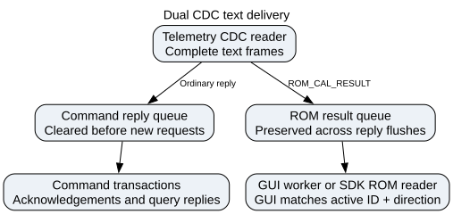

# Telemetry Architecture

> `[VERIFIED]` = confirmed from source.

File: `src/nml_hand_exo/applications/hand_exo_gui.py`

---

## UI structure

The Telemetry tab is one of two tabs in the main `QTabWidget`. Calibration and ROM are
modal dialogs, not tabs.

```
HandExoGUI (QWidget)
  └── QScrollArea
        └── container
              ├── Header + Connection section  (above tabs)
              ├── QTabWidget
              │     ├── "Controls" tab   (motor control, gestures, calibration, ROM)
              │     └── "Telemetry" tab  (_build_telemetry_tab())
              │           ├── QHBoxLayout (control row)
              │           │     ├── QPushButton "Refresh"     → _poll_telemetry()
              │           │     ├── QCheckBox "Auto-refresh"  → _on_telem_autorefresh()
              │           │     └── QLabel (status)
              │           └── QTableWidget  N rows × 4 cols
              │                 Motor | Position (°) | Torque | Current (mA)
              └── Log section  (below tabs)
```

The Controls tab uses a layout-redirect pattern during `_build_ui()` so all existing
`_build_*_section()` methods add to it unchanged. See `docs/gotchas.md`.

---

## Timer architecture

| Timer | Attribute | Interval | Purpose |
|-------|-----------|----------|---------|
| Device telemetry poll | `_angle_timer` | Configured 1-100 Hz; default 50 Hz | Motor-row angles and telemetry buffers |
| Telemetry renderer | `_telemetry_render_timer` | 100 ms | Throttled Qt table, motor-row, and hand-state painting |
| Sensor-only teleop poll | `_teleop_timer` | Configured telemetry rate | Angle frames while WebSocket teleop owns polling |
| EMG intent control | `_emg_control_timer` | 50 ms | Coalesce the newest per-ID direct command set for `SerialWorker` |

The device timer starts in `_connect()` and stops in `_disconnect()`.
Velocity/current DIRECT keeps it active at up to 10 Hz. Latched EMG teleop uses
a stricter real-time policy: 2 Hz, only the commanded and held IDs, with a
150 ms compact-telemetry deadline. A failed compact read is reported as missing
telemetry; it never enters the sequential text fallback while EMG commands are
active, because that fallback can exceed the firmware's 250 ms direct-command
watchdog. Poll requests are asynchronous and de-duplicated by
`SerialWorker`, so only one automatic read can be pending. EMG commands are also
executed by that worker rather than Qt's GUI thread. Each update is emitted as
one transport write containing the existing per-ID protocol lines, and pending
actions are coalesced per motor so a newer stop overrides an unsent motion
command without accumulating a serial backlog. High-rate UDP command
bursts may still defer polling briefly, then restart it after the idle timer.
Calibration and ROM dialogs own separate dialog-scoped timers at 100 ms.

---

## Precomputed lookup maps

Built once in `_connect()`, cleared in `_disconnect()`:

```python
_motor_idx:    dict[str, int]   # motor name → enumerate index (0-based list position)
_motor_row:    dict[str, int]   # motor name → telemetry table row index
_motor_dxl_id: list[int]        # widget index → DXL hardware ID
```

`_motor_idx` and `_motor_row` are built identically:
`{name: i for i, name in enumerate(motor_names)}`. They are the same mapping.
They are **not** the key to use for angle dict lookups.

`_motor_dxl_id[i]` is the DXL hardware ID for widget index `i`. Use this to look up
values in the dicts returned by `get_motor_angle('all')` and similar calls, which are
keyed by hardware DXL ID, not by list index.

```python
# Correct angle lookup in Controls-tab polling:
dxl_id = self._motor_dxl_id[i]
val = angles.get(dxl_id)    # ✓

# Wrong — angles dict is NOT keyed by name or by enumerate index:
val = angles.get(name)      # always None
val = angles.get(i)         # only works if DXL ID == list index (it doesn't)
```

The polling loop uses `_motor_dxl_id` directly — no `.index()` calls in the hot path.

---

## Polling path

```
_telem_timer.timeout → _poll_telemetry()
  try: positions = exo.get_absolute_motor_angle('all')  → {0: float, ...}
  try: torques   = exo.get_motor_torque('all')          → {0: float, ...}
  try: currents  = exo.get_motor_current('all')         → {0: float, ...}

  Each call is in an independent try/except.
  One failure does not block the other two.

  All three None  → status label: red "Read failed HH:MM:SS", return early
  Any success     → iterate _motor_row, update cells, status: green "Last update OK HH:MM:SS"
```

---

## Firmware response format and parser state `[VERIFIED]`

### `get_absolute_angle:all` — working
```
Motor 0: {name: index, id: 13, absolute_angle: 162.80}
```
Parser: `float("162.80")` — no suffix, works without modification.

### `get_current:all` — working (Python fix applied 2026-03)
```
Motor 0: {name: index, id: 13, current: 0.000 mA}
```
`_hand_exo.py:_parse_motor_data_block()` strips the ` mA` suffix:
```python
_m = re.match(r'[-+]?[\d.]+', val.strip())
motor_info["current"] = float(_m.group()) if _m else float(val)
```

### `get_torque:all` — source patched, **firmware reflash still required**

Before fix (buggy, active on device until reflash):
```
Motor 0: {name: index, id: 13, Torque: 0}Motor 1: {name: middle, id: 12, Torque: 0}
```
Three bugs: capital-T key, wrong variable (`val` not `torque`), no newline between entries.

After fix (`utils.cpp:552`, committed to source):
```
Motor 0: {name: index, id: 13, torque: 0.0000}
Motor 1: {name: middle, id: 12, torque: 0.0000}
```
Python parser handles lowercase `torque` with `float(val)` — no Python change needed.

**The device is not yet running the fixed firmware. Torque will show `—` until reflash.**

---

## Current column status

| Column | Status | Notes |
|--------|--------|-------|
| Position (°) | Working | |
| Current (mA) | Working | Python parser fix applied |
| Torque | Shows `—` | Source patched; device not yet reflashed |

---

## Phase-1 shadow telemetry

Normal fast telemetry deliberately reads position only because burst reads of
multiple registers previously destabilized the Dynamixel bus. Phase-1 shadow
telemetry uses a separate, opt-in scheduler:

1. The GUI configures explicit target IDs and starts the sampler.
2. Firmware reads one register per loop service interval, alternating current
   and position across those IDs.
3. Firmware derives velocity from successive position samples and buffers the
   newest record per ID.
4. The GUI polls `shadow_status` at up to 10 Hz. That command copies the buffer
   and causes no additional DXL traffic.
5. The GUI records raw evidence and a non-controlling contact estimate under
   `logs/shadow_contact/`.

The sampler runs only in velocity mode, is disabled at boot, and stops itself
on a mode change. Its contact labels are explicitly not part of the control
path.

---

## Open tasks

- [ ] Reflash OpenRB-150 with `utils.cpp` fix; verify Torque column populates
- [ ] Per-column enable/disable checkbox to reduce serial traffic

## Asynchronous automatic ROM results

Dual-CDC text frames are split into ordinary command replies and asynchronous
`ROM_CAL_RESULT` events. `flush_input()` clears only ordinary replies, so a new
telemetry request cannot erase a completed sweep. `SerialWorker` drains ROM events
on every work-loop iteration, including while idle, and emits `line_received` to
advance the GUI ROM queue. Blocking SDK callers use `read_rom_result()` to consume
one event without dropping later results. These are alternative consumers of the
same event queue, not independent subscriptions.

Previously the result occupied the ordinary reply queue and was commonly flushed
by the next NX poll. The motor could finish while the GUI waited for its 60-second
result timeout. Regression coverage is in `tests/test_rom_async_events.py`.
Auto-ROM now issues one explicit-ID request at a time on the selected GUI side,
accepts only matching ID/direction results, and aborts the run after a rejected
request or a 30-second missing-result timeout. An absent opposite hand is never
part of a single-side GUI campaign.
The event queue is bounded to 256 lines; an overflowing queue drops its oldest
event. This separation applies to `DualSerialComm`; the legacy single-port SDK
retains its synchronous text-result reader.

See [model and ROM timing settings](v0.9.0_implementation.md#model-speed-versus-automatic-rom-timing).

### Plot recovery after missing data

The Monitor table and torque plot share a horizontal splitter (table left,
plot right). Drag its divider to resize them; neither pane collapses. Without
pyqtgraph the table uses the available area. Tab height hints follow the selected
page, so larger hidden Setup/Integrations pages do not stretch Monitor beyond the
window. The plot and table share a 160-pixel minimum height and shrink together;
the table scrolls its rows internally when needed.

Non-finite telemetry clears that motor's averaging buffer immediately. A later
finite sample starts a fresh average, so an earlier NaN cannot keep the torque
series blank. Complete read failures clear the displayed sample buffers and
create gaps rather than repeating the old values. Plot histories retain gap
positions, but `finite_curve_data()` sends pyqtgraph only finite coordinates plus
an explicit connection mask. This avoids all-NaN axis data while preserving gaps
and measured/estimated boundaries. The live X window advances even when all
curves are empty, and old ROM markers do not pin it to an expired time range.
`tests/test_torque_plot_recovery.py` exercises recovery using real pyqtgraph curves.

<!-- graphviz:docs/figures/rom_result_delivery.dot -->

<!-- /graphviz:docs/figures/rom_result_delivery.dot -->


## Measuring rates and selecting the USB protocol

`AutoSerialComm` uses `info` metadata to select single CDC, legacy dual CDC, or
opt-in Protobuf USB. The Protobuf backend reads text on the primary CDC and
binary RPC replies on the secondary; the legacy dual backend reads NX on the
primary and text on the secondary. Those layouts must not be conflated.
`HandExo.get_fast_telemetry()` uses the common validated NX decoder for both.
The GUI disables legacy fallback and ASCII shadow sampling for Protobuf builds.

Model integration uses bounded 1 ms substeps, independent of the GUI's 50 Hz
acquisition target and 10 Hz rendering. The model does not command the motors.
Use `examples/diagnostics/benchmark_fast_telemetry.py` to measure achieved rates
and `HandExo.get_io_profile()` for exclusive firmware stage times. See
[USB protocol and I/O diagnostics](usb_protocol_and_io_diagnostics.md) for the
rate definitions, per-ID measurements and runnable examples.
