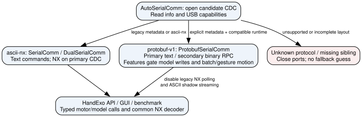

# USB protocols, model timing, and I/O diagnostics

## What rates mean

| Rate | Meaning |
|---|---|
| Model integration | 1 ms substeps by default, serviced by the main loop. No additional motor traffic. |
| Telemetry acquisition | GUI requests 50 frames/s by default; actual rate depends on transport and DXL I/O. |
| Measured position rate | Successful measured reads per motor. Estimates do not count. |
| GUI rendering | Table/hand painting is throttled to 10 Hz, independent of acquisition. |

Subdividing the predictor is not an LQR controller. The predictor has no authority
over motor goals. For a substep of duration `h`, lag `tau`, initial velocity `v`,
and constant desired velocity `u`, the implementation uses:

```
a = 1 - exp(-h/tau)
delta_angle = u*h + (v-u)*tau*a
v_next = v + (u-v)*a
```

Position-dependent load is recalculated between substeps. Goal and joint-limit
guards still bound every step. `EXO_MODEL_STEP_MS=1` can be set to 1--10 at build
time. Long scheduler gaps integrate at most 100 ms; subdivisions cannot recover
missed physical measurements or enforce hard real-time deadlines. `info` reports
the integration setting independently of the firmware version.

## Read-only benchmark

Close the GUI and Arduino Serial Monitor first. This script opens the ports,
disables verbose output, reads metadata/telemetry and resets diagnostic counters.
It does not enable motors, change motor modes, start ROM, or command motion.
Request only the IDs physically connected; an absent side measures timeouts.

From the repository root:

```powershell
python examples/diagnostics/benchmark_fast_telemetry.py --port COM10 --ids 11 12 13 14 15 16 17 18 19 --samples 500 --rate 0 --json build/telemetry-max.json
python examples/diagnostics/benchmark_fast_telemetry.py --port COM10 --ids 11 12 13 14 15 16 17 18 19 --samples 500 --rate 50 --json build/telemetry-50hz.json
```

The first run measures unpaced request/reply throughput; the second tests a
50 Hz telemetry-only workload. USB discovery selects single CDC, legacy dual CDC, or Protobuf.
`--telem-port COM11` supplies a sibling explicitly if OS enumeration is ambiguous.
The default baud is 1,000,000. `--rate` controls host pacing; it does not configure
the DXL bus or model. Repeat with one ID versus nine to observe scaling.

The JSON includes RTT median/p95/p99/max, actual frames/s, complete frames/s,
measured-position frames/s, missing/error records, repeated sample timestamps,
per-ID source counts, and device timestamp gaps. A complete frame here means
a valid position record for every requested ID. A successful frame can contain
unavailable records, so complete and measured rates are separate. Unique measured
timestamps indicate fresh bus acquisitions, not proof that the servo's internal
encoder/control registers refresh at the same frequency. During movement, model
frames do not establish a physical sensing limit. This is an SDK throughput test;
GUI scheduling/rendering overhead is additional.

The reported nine-motor benchtop Protobuf run returned 500/500 complete measured
frames at 120.18 frames/s (RTT median 8.28 ms, p95 9.05 ms), with no repeated
sample timestamps. That is a telemetry-only observation for that setup, not a
guarantee during motion or concurrent commands. The configured 50 Hz target and
1 ms predictor resolution are not measured throughput claims.

## Telemetry plus fixed-rate model updates

To exercise the update path used by a decoder while saturating telemetry:

```powershell
python examples/diagnostics/benchmark_fast_telemetry.py --port COM10 --ids 11 12 13 14 15 16 17 18 19 --samples 2000 --rate 0 --command-rate 50 --command-id 16 --json build/telemetry-plus-model-50hz.json
```

The script reads ID 16's current model parameters once, validates a write, then
reapplies those returned values at the requested command rate. It does not enable
torque or send motor goals. This measures model-update transport contention; it
does not simulate decoder computation, changing trajectories, or actuator writes.
The initial text getter reports rounded values, so the reapplied baseline can
differ slightly from the original floating-point parameters.

`--rate` sets telemetry pacing; `--command-rate` independently sets model writes
per second. Commands run between complete telemetry transactions, including
during paced telemetry's idle intervals. An in-flight read cannot be preempted.
Missed command periods are skipped instead of replayed in a burst. The JSON
`commands` section reports the actual transport, parameters, attempts, successful
acknowledgements/s, skipped slots, transaction times, errors, and start lateness
relative to the oldest pending deadline. The firmware profile covers both loads.

`HandExo.set_joint_model()` sends typed Protobuf fields when connected to a
Protobuf build advertising `USB Features: joint_model_write`; the default build
uses its existing ASCII command. Older Protobuf firmware requires a reflash for
this feature: the SDK reports the missing capability instead of silently using
ASCII. Keep Python bindings and firmware updated together. `get_joint_model`,
initial discovery, and I/O-profile snapshots remain low-rate text operations.

## Firmware time fractions

```python
from nml_hand_exo.interface import AutoSerialComm, HandExo

exo = HandExo(AutoSerialComm("COM10"), send_delay=0)
try:
    exo.connect()
    exo.reset_io_profile()
    for _ in range(500):
        exo.get_fast_telemetry(motor_ids=list(range(11, 20)))
    profile = exo.get_io_profile()
    for name, stage in profile["stages"].items():
        print(name, f'{100 * stage["fraction"]:.1f}%', stage)
finally:
    exo.close()
```

`reset_io_profile` resets both stage counters and `loop_stats`. `io_profile`
returns one delimited ASCII reply:

```
IO_PROFILE: version=1 window_us=1000
IO_STAGE: name=other calls=0 exclusive_us=400 max_span_us=0
IO_STAGE: name=dxl_read calls=5 exclusive_us=600 max_span_us=180
...
;
```

The example omits zero-valued stages. Real replies include all stages:

| Stage | Accounted work |
|---|---|
| `command` | ASCII parsing / Protobuf request handling, excluding nested stages |
| `control` | Exo update and ROM services, excluding nested stages |
| `model` | Model service, including clock/gate checks |
| `dxl_read` | Motor reads, Sync Read and ping, including library waits/timeouts |
| `dxl_write` | Motor writes, Sync Write, torque/mode setup, including library waits |
| `nx_pack` | Fast-telemetry gathering/framing outside measured bus/model/output calls |
| `usb_tx` | USB write/flush calls; may include waiting for host buffers |
| `bt_tx` | Bluetooth UART write/flush calls |
| `peripheral` | Gesture-button/OLED service |
| `other` | Remaining loop work and time waiting for the next host request |

Times are **exclusive**: a bus read inside command handling counts only under
`dxl_read`. Fractions are `exclusive_us / window_us` and sum to one. The profiler
is main-loop-only; it charges time across 32-bit `micros()` rollover. Nested scope
resets cannot reintroduce pre-reset durations. `max_span_us` is the inclusive
duration of one completed call and must not be summed across stages. `calls`
counts stage entries, including services that find nothing to update.

These are firmware wall times, not CPU-only costs, USB wire utilization, or host
latency. USB may continue transmitting after a write returns. Interrupt time is
charged to whichever scope was active. Divide stage totals by frame count to
estimate amortized cost per polling cycle. Paced runs include intentional idle
time in `other`; an unpaced run exposes the throughput bottleneck more directly.
The snapshot excludes its own reply, while reset acknowledgement and subsequent
host delays are part of the new window. Instrumentation itself adds small clock
and counter overhead. `loop_stats` provides aggregate loop mean/max, not a stage
breakdown. Older firmware without counters can still run the host benchmark.

## Optional Protobuf build

The default remains ASCII commands plus packed NX telemetry. Enable the binary
RPC interface explicitly for **all C++ translation units**:

```powershell
arduino-cli compile --fqbn OpenRB-150:samd:OpenRB-150 --build-path build/firmware-protobuf --build-property "compiler.cpp.extra_flags=-DEXO_USB_PROTOBUF=1" src/cpp/nml_hand_exo
```

Use `compiler.cpp.extra_flags`, not `build.extra_flags`: the latter replaces
OpenRB's MCU and USB definitions and causes missing `Sercom`/`TCC_INST_NUM` errors.

This uses the installed Arduino `nanopb` library (generated code uses nanopb
0.4.9.1, descriptor format 40). The default build does not require it. Axon and
`SINGLE_CDC` builds are incompatible with this option and fail at compile time.
Compilation alone does not flash the board.

Install the Python runtime for this optional firmware:

```powershell
.venv/Scripts/python -m pip install -e ".[protobuf]"
```

`info` retains `Version: 0.9.0` and adds:

```
USB Protocol: protobuf-v1
USB CDC Count: 2
USB Text Port: primary
USB Binary Port: secondary
USB Features: joint_model_write batch_motion
Model Step Ms: 1
I/O Profile: 1
```

The GUI replaces the Dual USB CDC checkbox with automatic discovery. Old builds
without metadata use physical sibling discovery and the existing direction probe.
New unknown protocol identifiers fail closed. Protobuf builds disable legacy NX
serial polling and the ASCII shadow stream. Fast-read failures do not trigger
text fallback. Slow configuration, home operations, calibration events,
`info`, `help`, and manual text diagnostics remain on the primary CDC. The binary
interface covers `get_telemetry_fast`, `set_current`, `set_velocity`, `set_angle`,
`set_absolute_angle`, `stop`, `set_joint_model`, `set_angles`,
`set_absolute_angles`, `set_currents`, `set_finger_angles`, `set_gesture`, and
`set_gesture_angle`. Other maintenance and calibration commands remain text.

The public `HandExo` setters and telemetry getter route automatically. Typed SDK
motor calls bypass string formatting and the legacy send delay. Existing GUI
command strings for those operations are translated by `ProtobufSerialComm`
before transmission; firmware calls the typed motor API directly. Explicit IDs,
finite-value checks, mode checks, current budgets, joint-limit clamps and the
existing direct-command watchdog remain in force. An OK reply indicates command
acceptance, not physical arrival. No mode implicitly enables torque.

`SET_JOINT_MODEL` (opcode 7) requires exactly one integer DXL ID and a nested
message containing all five float32 parameters: `gain`, `time_constant`,
`max_velocity`, `stiffness`, and `moment`. Units and bounds match the existing
SDK/firmware model API. Missing, non-finite, out-of-range, or conflicting fields
are rejected before model mutation. Accepted writes update predictor parameters
directly, without ASCII formatting/parsing or Dynamixel writes. The feature flag
distinguishes this additive opcode from earlier `protobuf-v1` firmware.

### Batch motion and gesture commands

Current builds advertise `USB Features: joint_model_write batch_motion`.
`batch_motion` gates opcodes 8--13; older Protobuf builds raise a missing-feature
error without sending an ASCII fallback. Reflash with the same
`-DEXO_USB_PROTOBUF=1` flag and update the Python SDK together.

| SDK method | Protobuf command | Meaning |
|---|---|---|
| `set_direct_current(id, mA)` | `SET_CURRENT` (2, already supported) | One signed current goal |
| `set_angles({id: degrees})` | `SET_ANGLES` (8) | Degrees relative to each motor's home/flip |
| `set_angles({id: degrees}, absolute=True)` | `SET_ABSOLUTE_ANGLES` (9) | Absolute motor degrees |
| `set_currents({id: mA})` | `SET_CURRENTS` (10) | Signed current goals in one USB request |
| `set_finger_angles({joint: signed_value})` | `SET_FINGER_ANGLES` (11) | Rest-relative signed -100..100; omitted/None holds |
| `set_gesture(name, state)` | `SET_GESTURE` (12) | Named library pose, e.g. `index`, `flex` |
| `set_gesture_angle(name, percent)` | `SET_GESTURE_ANGLE` (13) | Existing extend-to-flex 0..100 axis |

The new `set_angles` and `set_currents` APIs require Protobuf with `batch_motion`;
there were no production batch interfaces for these commands previously.
Mappings accept 1--18 explicit integer DXL IDs, with finite float values.
`set_angles` resolves every target before a single existing Goal Position Sync
Write, preserving calibrated limits, cached references, and offline-motor skips.
It does not normalize multi-turn wrist angles to 0--360 degrees.

`set_currents` validates all IDs, values, current mode, and position-hold guards
before applying targets. It then calls the existing guarded current setter for
each motor, preserving measured position checks, current clamp, flip convention,
and direct-command watchdog. These are **sequential DXL reads/writes**, not a
current Sync Write. A bus failure stops the remaining writes and returns REJECTED;
an earlier prefix may already have applied. No automatic retry or rollback is
performed. This transport change does not add a new current-control law.

Finger poses use six optional signed integer fields instead of colon-separated
text; a present zero means rest, and an absent field means hold. SDK rounding is
shared with the ASCII formatter. All fields are validated before one Sync Write.
Binary replies carry typed counts for commanded/held joints, written/offline
motors, unknown gestures, and zero-travel motors; the SDK exposes the familiar
`OK: finger_angles ...` acknowledgement to existing consumers.

Named gestures carry bounded name/pose strings (up to 31 ASCII letters, digits,
or underscores), rather than a serialized command line. Unknown names/poses are
rejected before motion. They call the existing gesture controller and retain
its firmware-wide scope: on dual firmware a gesture can address both hands.
They do not introduce a side filter or implicitly enable motors. Position-mode
guards apply to binary angle and gesture commands. Gesture acceptance is not
proof of motor arrival or successful writes to every servo. Internal gesture
lookup/state code still uses Arduino String; numeric command serialization and
the ASCII parser are bypassed.

Existing GUI strings for these commands are translated to binary too. For the
new batch commands, the explicit-ID string form is `set_angles:16=5:17=-5`
(relative degrees), `set_absolute_angles:16=180:17=180`, or
`set_currents:16=80:17=-60`. Prefer the typed SDK methods in new decoder code.

The schema is [exo_usb.proto](../protocol/exo_usb.proto), with bounded allocation
specified in [exo_usb.options](../protocol/exo_usb.options). Generated C files
live under the sketch's `protocol/`; Python bindings live in `interface/`.
Regenerate with `tools/generate_usb_protocol.py` using nanopb 0.4.9.1 and
grpcio-tools 1.84.0. No source edits or generator runs are required to compile.

### Framing and recovery

Protobuf messages need an external boundary on a byte stream; the format itself
is not self-delimiting. See [the official Protobuf guidance](https://protobuf.dev/programming-guides/techniques/#streaming).
Each message has a seven-byte envelope: `PB`, version byte 1, uint16 little-endian
payload length, uint16 little-endian CRC16-CCITT-FALSE. CRC covers version,
length and payload. Requests are bounded to 128 bytes and 18 unique IDs;
responses are bounded to 640 bytes. Required sequence numbers correlate replies.
Malformed, truncated, CRC-invalid or oversized frames cannot dispatch a motor
command. Partial request assembly expires after a 50 ms inter-byte gap. At most
128 bytes and one complete request are processed per main-loop pass.

The SDK never automatically retries a motion command after a timeout: a lost ACK
does not establish that the device failed to act. It discards replies with a
different sequence. Firmware does not provide persistent deduplication; clients
must not resend motion messages as a recovery strategy.

Telemetry responses carry the existing NX v2 packed frame in a Protobuf `bytes`
field. That preserves its compact fixed-size records, units, provenance and
timestamps, reusing the SDK checksum and record validation. Protobuf overhead
does not make this already-binary payload smaller; the gain is removing text
request parsing/formatting and keeping binary traffic off the text reader.

<!-- GraphViz diagram published below by graphviz_sync. -->

<!-- graphviz:docs/figures/usb_protocol_discovery.dot -->

<!-- /graphviz:docs/figures/usb_protocol_discovery.dot -->
