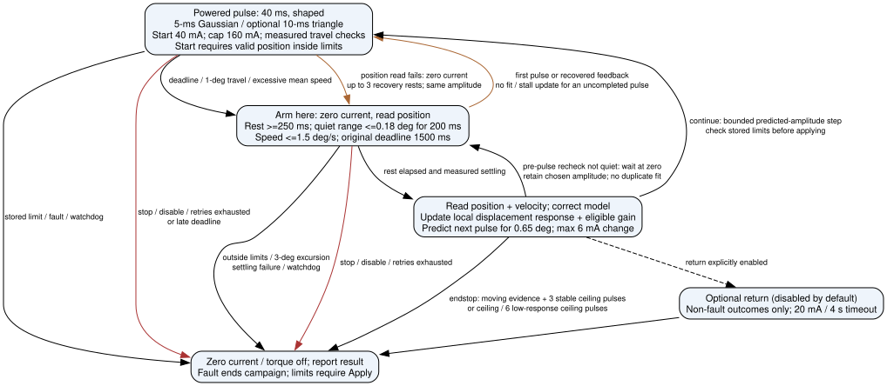

# Firmware v0.9.0 — joint-state telemetry

This is the finalized implementation contract for the [proposal](v0.9.0_joint_state_model_plan.md).

## Bus ownership

All **telemetry** uses one fleet-wide gate: while any direct command, position move, auxiliary hold move, or ROM sweep is active, and for 250 ms after activity ends, telemetry comes from the per-motor model. Even a query of the idle hand must not read the shared bus during motion of the other hand. Offline motors remain unavailable. Only a successful idle read corrects the model.

Safety/control feedback is an explicit exception to the proposal's blanket no-read rule: direct-control limit checks, ROM detection, and the current governor retain real feedback. Estimates never certify arrival or detect a physical endstop. Shadow instrumentation pauses during the telemetry holdoff. This release removes competing fleet telemetry reads; it does not claim the entire bus is read-free during motion.

## Wire contract (firmware >= 0.9.0)

Commands require explicit integer DXL IDs, finite numbers, exact argument counts, and return `ERROR:` on invalid input without changing parameters. All replies retain the `;` delimiter. Parameters affect estimates only and never write motor registers or enable torque.

```text
set_joint_model:<id>:<gain>:<time_constant>:<max_velocity>:<stiffness>:<moment>
OK: set_joint_model id=<id>;
get_joint_model:<id>
JOINT_MODEL: id=<id> gain=<g> time_constant=<t> max_velocity=<v> stiffness=<k> moment=<m> trigger=<tau|nan>;
set_estimate_holdoff:<ms>
OK: set_estimate_holdoff ms=<ms>;
set_joint_trigger:<id>:<tau_Nm>
OK: set_joint_trigger id=<id>;
clear_joint_trigger:<id>
OK: clear_joint_trigger id=<id>;
```

Ranges: gain (deg/s per mA) 0.001–10; time constant (s) 0.01–10; maximum velocity (deg/s) 0.1–300; stiffness (Nm/deg) 0–1; signed resisting moment (Nm, encoder-positive axis) -1–1; holdoff 50–5000 ms; trigger (Nm, flexion-positive convention) 0–1. Defaults: gain 0.1, time constant 0.15, maximum velocity 60, stiffness 0, moment 0. Triggers are cleared at boot. Thresholds are stored for future assistance; they do **not** autonomously initiate motion in this release. The EMG decoder and automatic counter-torque controller remain external.

The `NX` binary header retains `<2sBBBHIH>` and its additive checksum. Header version is **2**; each record is `<BBhiiiiBQI>` (33 bytes). The first 20 bytes keep the existing ID, error, current mA, velocity raw (0.229 rpm/unit), position ticks, absolute centidegrees and relative centidegrees. The `sources` byte at offset 20 contains two-bit fields: position at bits 0–1, current at 2–3, velocity at 4–5. Values are 0 unavailable, 1 measured, 2 estimated (3 reserved). Header flags retain transport method in bits 0–3 and use bit 7 (`TELEM_SOURCE_ESTIMATED`) when the read gate selects estimates. Method 4 is the model. The Python decoder accepts both v1 and v2; update the SDK with the firmware. Unavailable fields decode to `None`, never a fictitious zero.

Following `sources` are a little-endian uint64 UTC Unix timestamp in milliseconds and a uint32 monotonic sample timestamp (`millis()`). UTC zero means unsynchronized; the monotonic timestamp remains valid. Idle Sync Read records are timestamped at transaction completion, not at the motor's internal encoder acquisition instant. Estimated records use the model report time. Error records carry the attempted sample's timestamp, but their values remain unavailable.

Current in current-position mode uses the signed applied current ceiling during modeled travel and the bounded holding-load estimate near the target (see below), not measured consumption or wearer force. In velocity/position-only modes, current is unavailable because no applied-current input is known. Torque uses the existing 0.00115 Nm/mA constant; stiffness/moment affect modeled motion and holding effort, not this electrical torque conversion. Neither estimate is a contact sensor.

## Model and persistence

The portable `joint_state_model.h` now advances in bounded 1 ms substeps (`EXO_MODEL_STEP_MS`, compile-time range 1--10 ms), independently of telemetry polling. Each substep integrates both velocity and displacement analytically for a constant input; position-dependent load is recalculated between steps. One service call integrates at most 100 ms, with at most 100 substeps and one exponential evaluation per moving joint. This remains a telemetry predictor, not an LQR or actuator controller. Current minus the equivalent resisting load produces a bounded target velocity. A first-order lag smooths velocity; a position goal limits each step to the remaining distance, with no overshoot. Reversals discard velocity pointing away from the new goal. Every estimate stays within calibrated limits, including multi-turn windows. Long scheduler gaps use at most 100 ms of integration, avoiding catch-up jumps. The model cannot establish physical settlement: existing measured control feedback clears motion activity, then the quiet holdoff permits idle telemetry.

Optional per-motor `joint_model` objects in calibration JSON use the five named parameters above. `joint_trigger` is an optional number or null. Applying either requires an explicit `name_to_id` mapping and firmware >= 0.9.0. Parameters are RAM-only on the controller; the calibration JSON is their persistent source.

### Quiet estimates and physical holding current

A position estimate within `JointStateModel::POSITION_SETTLE_DEG` (0.1 degree,
approximately one encoder count) of its goal stops integrating velocity without
snapping its angle. Its estimated holding current is
`clamp((moment + stiffness * (angle - home)) / torque_constant, -allowance, allowance)`.
The default zero-load model therefore reports zero estimated current at its goal,
instead of reporting the entire current allowance indefinitely. Configured loads
retain signed holding effort, bounded by the allowance. A target outside the
deadband restores travel effort; stopping short of a target does not imply zero
current. Direct-current control retains its commanded effort, including during ROM.

This rule applies even when another joint keeps the shared bus in estimated mode.
It does not clear controller motion flags or open the telemetry gate: physical
arrival still requires control feedback. Once normal idle Sync Reads resume,
nonzero measured current is reported unchanged. There is no noise subtraction
or automatic calibration of holding load. The load model does not identify gravity
from a single pose and cannot certify that the real joint is stationary.

For actual relaxation, the existing `HandExo.set_hold_current(mA)` / ASCII
`set_hold_current:<mA>` changes the global settled/load-shed current allowance in
current-position mode. Zero removes that holding allowance, so external loads may
move the joint; active moves retain their separate allocation until the controller
concludes them. This is a hardware control setting, separate from the telemetry
model. Inspect `HandExo.current_status()` / `current_status` for the applied hold
allowance and budget. `set_total_current_lim` is a fleet ceiling, not a command to
consume that current; the allocator also enforces a floor based on the configured
motor count and holding allowance.

On XC330 motors, current sensing is at the input supply, so a small nonzero idle
reading is not by itself a measurement of gravity-compensation torque. See the
[ROBOTIS current-sensing and Goal Current documentation](https://emanual.robotis.com/docs/en/dxl/x/xc330-t288/#goal-current102).
The estimator change does not alter motor goals, current limits, torque enable,
startup behavior, or ROM control.

## UTC synchronization

```text
set_utc_time:1789473600123
OK: set_utc_time utc_ms=1789473600123 synchronized=1 uptime_ms=44;
get_utc_time
UTC_TIME: utc_ms=1789473600133 synchronized=1 uptime_ms=54;
```

The argument is an unsigned decimal Unix timestamp in **milliseconds**, UTC; the example is 2026-09-15T12:00:00.123Z. Valid range is 1 to 253402300799999. Missing, extra, negative, nonnumeric, or out-of-range input returns `ERROR:` without changing the offset. `get_utc_time` takes no arguments. Before the first successful set, `utc_ms=0 synchronized=0`. Synchronization is volatile and must be repeated after reboot.

`utc_clock.h` extends 32-bit uptime across rollover and adds elapsed uptime to the synchronized UTC anchor. The main loop services it continuously. Resync may move UTC forward or backward; control timers, watchdogs and the telemetry holdoff continue to use monotonic uptime. This is a clock-offset calibration, not an oscillator drift calibration or a precision time protocol. Resolution is 1 ms; serial transit latency and oscillator drift remain uncompensated.

Python exposes `HandExo.synchronize_utc(when=None)` and `get_utc_time()`. `when` must be a timezone-aware `datetime`; omitting it captures the PC's current clock immediately before sending. Both methods gate on firmware >= 0.9.0. The GUI synchronizes during its connection worker's handshake, after `info` and before polling starts, on every supported connection/reconnection. A sync failure fails that handshake visibly. Older firmware receives no new command. The binary decoder exposes `utc_timestamp_ms`, `utc_synchronized`, and `sample_timestamp_ms` per motor while retaining the header's `timestamp_ms`.

## Host display and streams

### Model speed versus automatic ROM timing

`applications/_hand_state.py` only converts a reported angle to a schematic curl;
it has no integrator, speed cap or easing timer. Firmware dynamics live in
`src/cpp/nml_hand_exo/joint_state_model.h`. Defaults are gain **0.1 deg/s/mA**,
response time constant **0.15 s**, and velocity cap **60 deg/s**. With zero modeled
load and 120 mA effort, the estimated steady velocity is only 12 deg/s. A fast or
multi-turn joint can therefore outrun the displayed estimate substantially.

Use `HandExo.get_joint_model(id)` and `HandExo.set_joint_model(id, gain=...,
time_constant=..., max_velocity=..., stiffness=..., moment=...)` to tune each
integer DXL ID without reflashing. Preserve the existing stiffness and moment
when adjusting speed. Gain can be fitted from observed steady encoder speed
divided by applied current in a zero-load approximation; current ceilings are
not current measurements, so this is a heuristic rather than an identified motor
model. Increasing the speed cap alone cannot help when gain times effort is
already below the cap. The time constant controls acceleration lag. Save the five
settings as a motor's `joint_model` profile object and apply that profile for
persistence; device settings alone reset at reboot.

### Pulsed Auto-ROM and gain refinement

**Historical v0.9.0 procedure:** the values in this subsection are superseded by
[v0.9.1 measured pulse-response calibration](v0.9.1_pulse_calibration.md).
Current firmware uses 20-ms pulses and bounded response-based amplitude selection.

Auto-ROM now alternates a bounded current pulse with a zero-current rest. It
uses real encoder feedback independently of the telemetry predictor. The
`ROM_CAL_*` block of `config.h` defines:

| Setting | Default | Role |
|---|---:|---|
| `ROM_CAL_START_CURRENT_MA` / `ROM_CAL_MAX_CURRENT_MA` | 80 / 150 mA | First pulse and independent register-write ceiling |
| `ROM_CAL_CURRENT_STEP_MA` | 5 mA | Increase between complete pulses |
| `ROM_CAL_PULSE_ON_MS` / `ROM_CAL_PULSE_OFF_MS` | 150 / 200 ms | Powered interval and zero-command rest |
| `ROM_CAL_STEP_INTERVAL_MS` | 40 ms | Powered position-limit checks |
| `ROM_CAL_ONSET_DEG` | 0.3 degree | Minimum pulse progress above encoder noise |
| `ROM_CAL_PROGRESS_DEG` | 1 degree | Prior travel required before accepting an endstop |
| `ROM_CAL_STALL_PULSES` | 3 | Consecutive pulses without further powered travel |
| `ROM_CAL_STALL_MIN_CURRENT_FRAC` | 0.8 | Stall conclusion requires at least 120 mA |
| `ROM_CAL_TIMEOUT_MS` | 20,000 ms | Whole-sweep watchdog, not a mandatory dwell |
| `ROM_CAL_RETURN_CURRENT_MA` / `ROM_CAL_RETURN_TIMEOUT_MS` | 80 mA / 4,000 ms | Bounded position-controlled return |

Amplitude stays constant during each pulse and rises only after its rest and
feedback. Without travel, fifteen pulse/rest cycles reach the ceiling in about
5.25 s plus I/O. Continued travel at 150 mA may continue until stall or watchdog.
Current is zeroed before the post-pulse read. Failed position feedback, external
STOP (including during rest), disabling the target, a mode change, or an overly
late pulse deadline aborts. A cooperative loop cannot retroactively shorten an
overrun: it stops and rejects that pulse rather than learning from it. The
independent direct-command watchdog remains active.

Measured position is checked against stored joint limits before each pulse and
at the powered polling cadence. Reaching that boundary yields `status=limit`
with no discovered endstop. A valid `ok` endstop requires prior travel followed
by repeated powered pulses without further progress; the zero-current interval
alone is never a stall. Endstops remain subject to the GUI's explicit Apply.
One wrong-direction probe may reverse the command sign after the rest; a second
wrong-way result aborts. Return uses a current-position hold, not another pulse
campaign. Faults stop the firmware batch and the GUI queue.

After each pulse and rest, real position and optional measured velocity correct
the joint model. The next pulse starts from this feedback, so estimation error
does not accumulate over a whole sweep. The telemetry frame remains marked
estimated while ROM owns the bus; it never relabels a commanded current as measured.

`rom_pulse_fit.h` fits only gain, keeping the configured time constant, speed
cap, stiffness and moment fixed. For the unsaturated zero-load lag model
`dv/dt = (gain * I - v) / tau`, integrating a pulse of duration `a` followed by
zero current for duration `b` gives:

```text
delta_angle = v_start * tau * (1 - exp(-(a+b)/tau))
            + gain * I * (a - tau * (1-exp(-a/tau)) * exp(-b/tau))
```

The helper solves this expression using measured displacement and starting
velocity, the signed current command, and actual elapsed durations. It checks
the measured tail velocity against the fitted response. It rejects nonfinite
inputs, wrong-way or subthreshold motion, saturation, nonzero configured loads,
and poor tail-velocity agreement. Learning also requires further progress beyond
the prior powered endpoint, so stalled and recoiling pulses cannot lower gain.
Each accepted candidate is limited to +/-25% of the prior gain, then blended at
25% (at most 6.25% change per accepted pulse). These guards are heuristics: a
single pulse cannot identify lag, gravity, friction and gain independently.
Current command is not measured motor torque; the learned value is a local
command-to-motion gain under the calibration conditions.

`ROM_CAL_UPDATE_MODEL_GAIN=true` enables the requested automatic updates. They
remain in RAM and affect telemetry only. `ROM_CAL_RESULT` adds `pulses`,
`fit_samples`, and `model_gain`; the SDK returns these fields and the GUI log
shows them. `get_joint_model:<id>` / `HandExo.get_joint_model(id)` returns the
full resulting model for saving in a calibration profile. Reapplying an older
profile can replace these fitted values; reboot restores defaults.

The model can advance at 1 ms resolution when the main loop is serviced; GUI acquisition defaults to 50 Hz and the hand
view refreshes at 10 Hz. These rates do not control pulse timing.

On dual CDC, asynchronous `ROM_CAL_RESULT` lines have their own queue. Command
reply flushes (including before NX polls) preserve them. The GUI serial worker
drains that queue even between requests and forwards results to ROM progression;
the SDK's `read_rom_result()` consumes one queued event at a time. This prevents
lost results from imposing the former GUI's 60-second fallback wait on each gesture.
The GUI now expands gesture groups into `calibrate_rom:<id>:<direction>` requests
using only the selected side's IDs. A result must match both the active ID and
direction. Right-only thumb flex therefore queues IDs 13, 14 and 15, each expecting
one result, rather than asking dual firmware to sweep six motors. A rejected
command or a 30-second per-motor timeout cancels the remaining run. Cleanup disables
only that run's target IDs. The timeout covers the firmware's 20-second watchdog,
4-second return and serial transit; it is not a normal delay between joints.

The GUI's Hand State tab and UDP inset consume the same latest NX snapshot. Each normalized motor sample retains its position source, sample uptime and UTC timestamp; table averaging never changes the displayed hand pose or pairs an old pose with a new timestamp. The host does not run a second motion predictor. Red solid segments indicate measured positions, amber dashed segments indicate estimates, and grey dotted segments indicate unavailable or stale positions. Missing joints retain their last shape in grey. [GUI mapping and data flow](gui_workflow.md#hand-state-model-integration-verified) describes calibration, handedness and schematic limitations.

The GUI keeps field sources and sample UTC/uptime in telemetry metadata, which is included in its UDP JSON stream. Estimated torque segments are dashed; the table has per-field source tooltips and the status labels identify estimates. Smoothing buffers reset at source changes so prior estimates cannot be relabeled as measurements. Estimated cached positions cannot seed a position hold. Calibration profile application waits up to one second for measured idle positions before choosing the multi-turn epoch; it fails without applying the profile if motion continues.

Existing numeric LSL angle/torque channels retain their layout and LSL clock. A companion `NMLHandExoTelemetrySources` stream contains the packed `sources` byte per motor (as an exactly representable numeric value). LSL sample timestamps remain host LSL-clock timestamps; device UTC is exposed through the API/UDP metadata, not substituted for LSL's clock.

Legacy scalar state queries share the same gated sampler and add `source:` to each motor block. Gesture percentage queries project the same model during motion; legacy NGA2 pose packets do not carry the new per-field metadata. The optional Axon protocol has no estimated-source encoding and therefore reports fields unavailable during the gate rather than labeling estimates measured. `info_verbose` omits live register fields while the gate is closed.

## Validation

Hardware-independent C++ model and bus-routing tests, Python protocol/GUI tests, and OpenRB-150 default and Axon builds cover the implementation. The read-only gesture library is now `const`, placing approximately 17 KB of definitions in flash rather than RAM. See the build and measurement instructions in [USB protocol and I/O diagnostics](usb_protocol_and_io_diagnostics.md). Physical accuracy and the reported device stall still require bench verification; no hardware validation is implied by a successful build.

The diagram below follows the current v0.9.1 pulse controller described in
[the updated procedure](v0.9.1_pulse_calibration.md).

<!-- graphviz:docs/figures/rom_pulse_calibration.dot -->

<!-- /graphviz:docs/figures/rom_pulse_calibration.dot -->


## ROM timing diagnostics

The benchtop log with 0--3 completed pulses reported `fit_samples=0` and unchanged
`model_gain=0.100000` throughout: learning had not caused those terminations.
ID 13's configured 190--227.13 degree window also blocked the requested direction;
later starts near 233 degrees were already outside that window. The firmware
reports `status=limit`, not a discovered endstop, and does not attempt an implicit
return move when the starting position is outside the stored limits. Verify the
profile/mechanics rather than widening the limits automatically.

The old generic `aborted` status could not identify ID 14's cause. Results now
include `reason`, `pulse_on_ms`, `max_pulse_on_ms`, `recoveries`, `angle`,
`limit_min`, and `limit_max`. ROM position/velocity reads and current writes use
10 ms timeouts. A failed position read zeros current and enters a 200 ms recovery
rest, retrying the same amplitude from fresh feedback up to three times; these
invalid pulses cannot change gain or endstop statistics. Further failures abort.

The main loop services ROM before commands and between at most one buffered
command per interface per pass. OLED/button work is suspended during a sweep.
USB NX requests no longer copy/flush each binary frame to the 115200-baud Bluetooth
UART: for nine NX v2 records that copy alone took approximately 26.9 ms of UART
wire time. Bluetooth-origin requests still receive their binary UART reply.
These changes remove specific blocking paths; the next hardware run and its
explicit termination reason are needed to confirm the remaining ROM behavior.
