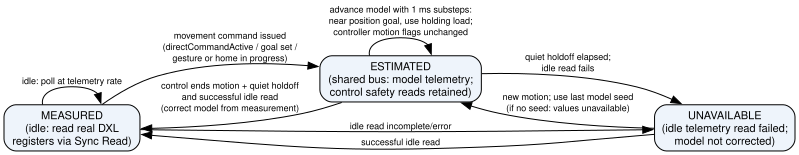
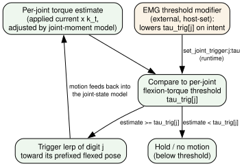

# v0.9.0 Plan — Internal Joint-State Model and Poll/Estimate Telemetry

> Status: **PLAN ONLY.** Nothing here is implemented yet. This document is the
> agreed design for the v0.9.0 firmware + host changes. `[EXISTING]` marks
> behavior/fields already in the codebase today; everything else is proposed.

## Motivation

Reading `PRESENT_CURRENT`/`PRESENT_VELOCITY` from the whole fleet on the high-rate telemetry poll wedges the Dynamixel bus when motors are moving under load (observed after a Home All in `current_position` mode with an 800 mA budget: telemetry died and Disconnect hung until the microcontroller was power-cycled). The position-only fast read has always been stable; every telemetry problem this session came from adding live current/velocity reads to that path while the bus was busy.

The fix is architectural, not another read tweak: **do not poll the bus for state while movement commands are being issued.** Instead, switch to an internal per-joint model that produces interpolated estimates during motion, and read real registers only when the device is idle. Telemetry always reports in the same shape; a per-report flag says whether each value was `MEASURED` or `ESTIMATED`.

## Core behavior: measured ↔ estimated switching

- **MEASURED (idle):** no movement command is active, so the bus is free. The fast-telemetry path reads real registers (position, and — only here — current and velocity) via one Sync Read. This is the current v0.8.x stable path, restored to position-first safety.
- **ESTIMATED (motion active):** any movement source is active — a direct velocity/current command, a freshly issued goal, or a gesture/home in progress. The bus is NOT read for state; the internal joint model advances each tick and supplies angle, current/torque, and velocity estimates.
- **Transition to ESTIMATED:** the instant a movement command is issued.
- **Transition back to MEASURED:** motion has settled AND the device has been quiet for `ESTIMATE_HOLDOFF_MS` (a debounce so a burst of commands does not flap the mode and so no read races the tail of motion).

"Movement active" is already derivable from existing per-joint state `[EXISTING]`: `directCommandActive_[]`, `directCommandDirection_[]`, `motorMoving_[]`, `goalAngleValid_[]`/`goalAngle_[]`, `goalIssuedMs_[]`, plus the ROM sweep phase and the home/gesture sequencing.

### Seamless, uniform reporting

The switch must be invisible to consumers except for one flag. The telemetry frame and every downstream stream (LSL, UDP, the GUI table and torque plot) report the same fields in the same layout in both modes. A new boolean/enum per report (and ideally per field) records the mode:

- Frame-level `flags` bit: `TELEM_SOURCE_ESTIMATED` (0 = measured, 1 = estimated).
- Optional per-field validity already exists in spirit (`error`, the Axon "unavailable" concept); extend it so a field can be `measured`, `estimated`, or `unavailable`.

Consumers that do not care keep working unchanged; the GUI torque plot can shade or dash the estimated spans so an operator can tell model from measurement.

## The internal joint-state model

Per joint, maintained in firmware, advanced on a fixed tick while in ESTIMATED mode (and corrected from the real reading on each return to MEASURED):

- **State:** estimated angle, estimated angular velocity, estimated current/torque.
- **Inputs:** the commanded goal (`goalAngle_` `[EXISTING]`), the applied current (`appliedCurrents_` `[EXISTING]`, the value actually written to `GOAL_CURRENT`), elapsed time, and the joint's calibrated travel.
- **Angle estimate:** interpolate along a modeled trajectory from the angle at motion start toward the goal, using a simple motion profile rather than snapping to the goal — so the estimated trace ramps the way the joint really moves.
- **Current/torque estimate:** derive from `appliedCurrents_ * XC330_T288_TORQUE_CONSTANT``[EXISTING]`, adjusted by the joint-moment model below.
- **Correction step:** each time the model hands back to MEASURED, snap the model state to the fresh real reading so estimate error cannot accumulate across motion episodes.

### Tunable dynamics (PID-style)

The mapping from applied current to actual motion depends on how the exo fits the hand and how fast a given joint moves for a given current. Expose per-joint tuning so the interpolation can be made well-behaved on real hardware:

- Per-joint gains describing the current→velocity/current→displacement response (a first-order or PID-like model), tunable at runtime and persistable with the calibration profile.
- Goal: the estimated trajectory matches the measured trajectory closely enough that the MEASURED→ESTIMATED seam is not visible in the telemetry streams.
- Tuning is a bench/calibration activity; defaults must be safe (an untuned joint still produces a monotonic, bounded estimate).

### Dynamic joint moments (spring/impedance term)

Rather than treating the load as a static spring, the model should accept a per-joint **moment / stiffness** term that can change at runtime, so the same applied torque yields different estimates under different loads — and so the exo can deliberately apply a **counter-torque** to oppose motion. This generalizes the current static assumption and is the hook the interaction mode below needs.

## Forward-looking: torque-triggered assisted motion + EMG threshold

Once each joint's torque is continuously estimated (or measured when idle), a new assistance mode becomes possible:

- Continuously sense approximate per-joint torque.
- If the flexion-direction torque on a digit exceeds a per-joint threshold `tau_trig[j]`, the exo lerps that digit toward a prefixed flexed pose.
- The threshold is **externally adjustable** — an EMG decoder running off the microcontroller lowers `tau_trig[j]` on detected intent. This gives a spectrum:
  - **EMG-only:** thresholds effectively drive motion (torque confirmation off).
  - **Hybrid:** measured/estimated joint torque drives motion, and EMG lowers the threshold to "confirm" — so intent + mechanical torque together decide.
  - **Torque-only:** fixed thresholds, no EMG.

This requires a clean host interface to set/adjust the per-joint trigger threshold at runtime (e.g. `set_joint_trigger:<id>:<tau>`), decoupled from the EMG source so the decoder stays external to the firmware.

## Proposed interface additions (to be finalized during implementation)

Per the protocol change gate in `serial_protocol.md`, names/args/response are drafted here and finalized with the firmware + `_hand_exo.py` changes atomically.

- Telemetry frame: add `TELEM_SOURCE_ESTIMATED` to the header `flags`, and
  extend per-field validity to measured/estimated/unavailable.
- `set_joint_model:<id>:<params...>` / `get_joint_model:<id>` — per-joint model
  gains and moment/stiffness.
- `set_estimate_holdoff:<ms>` — the MEASURED debounce.
- `set_joint_trigger:<id>:<tau>` / `clear_joint_trigger:<id>` — torque-trigger
  threshold for the assisted-motion mode (EMG adjusts this at runtime).
- Version gate: `>= 0.9.0`.

## Open questions

- Exact motion-profile form for the angle interpolation (trapezoidal vs
  first-order lag vs PID follower) and how many gains to expose.
- Whether velocity is estimated or reported unavailable during motion.
- Where the estimate/measured correction is applied when only *some* joints are
  moving (per-joint mode, not a single global mode) — the model is per joint, so
  the frame can mix measured and estimated joints; the flag must therefore be
  per-field/per-joint, not only frame-level.
- Persistence: which model/trigger parameters live in the calibration profile.

## Non-goals for v0.9.0

- The EMG decoder itself stays external (host/off-MCU). v0.9.0 only provides the
  threshold interface it drives.
- No change to the impedance ROM calibration sweep (v0.8.0) beyond consuming the
  same joint-state model where convenient.

## Relationship to current code

- Restore the **position-first, idle-only** current/velocity read on the fast
  path (undo the always-on fleet current+velocity Sync Read that wedges the bus).
- Reuse existing per-joint state (`goalAngle_`, `appliedCurrents_`,
  `directCommandActive_`, `motorMoving_`, `goalIssuedMs_`) as the model's inputs
  and the "is moving" signal rather than adding a parallel notion.
- Host GUI already switched device I/O to the serial worker thread and made
  polling resume robust; the estimate/measure switch rides on that poll loop.
